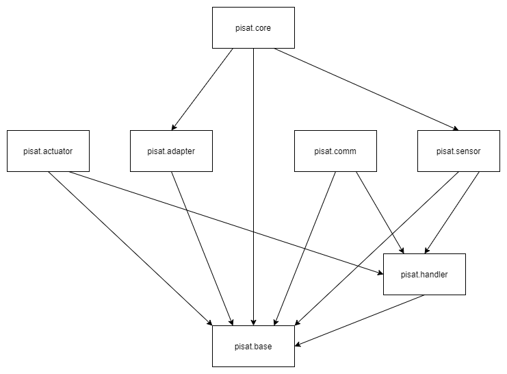

# pisat のサブパッケージについて

## 用語の定義

以下では色々な用語を用いますが，一般に使われている意味や読者の解釈とは一致しない可能性があります．
そのため，まず誤解の生まれそうな用語についての説明を行っておきます．

### パッケージ
パッケージは Python パッケージを意味しており，基本的には
 [Python 公式の定義](https://docs.python.org/ja/3/tutorial/modules.html)に従います．
複数の Python モジュール (Python スクリプト) の名前空間を定義し，他の Python モジュール内で
ドット '.' 演算子を用いてアクセスできるようにしたものがパッケージです．
簡潔に言えば，Python スクリプトを含み，かつ \_\_init\_\_.py というスクリプトを含むディレクトリのことです．

### サブパッケージ
パッケージがパッケージを含むとき，含まれるパッケージをサブパッケージと呼びます．

### フレームワーク
[アプリケーションフレームワーク](https://ja.wikipedia.org/wiki/%E3%82%A2%E3%83%97%E3%83%AA%E3%82%B1%E3%83%BC%E3%82%B7%E3%83%A7%E3%83%B3%E3%83%95%E3%83%AC%E3%83%BC%E3%83%A0%E3%83%AF%E3%83%BC%E3%82%AF)に同義です．
pisat では CanSat は1つのアプリケーションです．
pisat を用いて CanSat などのアプリケーションを構築する際の枠組みを pisat フレームワークと呼んでいます．
一般のフレームワークを意味する場合は単にフレームワークと呼び，特に pisat のフレームワークを指す場合は
 pisat フレームワークと呼びます．

### アーキテクチャ
協調的に動作するソフトウェアの基本設計や設計思想などを指します．
設計と読み替えても基本的には差し支えないです．

### pisat システム
特に pisat フレームワークのアーキテクチャを指します．

### ライブラリ
汎用性の高いプログラムを再利用可能な形式で配布したものを指します．

### コンポーネント
pisat.base.Component を継承したサブクラスをコンポーネントと呼んでいます．
Component クラスは pisat システム上の部品の性質を定義するクラスであり，
pisat で定義されている多くのクラスはこのクラスを継承しています．

### ミッション
ここでのミッションとは，順序関係が不変な逐次処理型のアプリケーションのことです．
pisat フレームワークはこのミッションを作成するためのフレームワークです．

## サブパッケージの種類

pisat にはいくつかのサブパッケージがあります．
サブパッケージは目的別に整理されています．

### [pisat.core](../../core/)
pisat のフレームワーク用のサブパッケージです．
フレームワーク用のサブパッケージの核はこの pisat.core です．
したがって，pisat システムの枠組みの多くはここで提供されることになります．
pisat システムの最も高レベルな API です．

### [pisat.actuator](../../actuator/)
アクチュエータ関連のコンポーネントを含むサブパッケージです．
DC モーターやサーボモータなどを実装したクラスや，
低レベルの実装を抽象化し様々な機能を追加したクラスなどが含まれます．

### [pisat.adapter](../../adapter/)
センサー値などを解析するためのコンポーネントを含むサブパッケージです．
このサブパッケージに含まれるコンポーネント単体での効果はあまり大きくありませんが，
pisat システムではなくてはならない存在です．

### [pisat.base](../../base/)
pisat システムの根幹を担うクラスなどを定義するサブパッケージです．
このサブパッケージで定義されているクラスは他のサブパッケージで定義されているクラスの多くに
継承される形で全体のシステムに反映されます．

### [pisat.comm](../../comm/)
通信関連のコンポーネントを含むサブパッケージです．
通信機器を実装したクラスや，ミッションで利用しやすい通信プロトコルなどを提供します．

### [pisat.config](../../config/)
pisat システムの整合性を維持するための定数定義や型定義をするサブパッケージです．
pisat システムを利用する際に必ずしもこのサブパッケージ内の定数や型を使う必要はありませんが，
思いがけないバグを引き起こす可能性があります．

### [pisat.handler](../../handler/)
ハードウェア利用時のミドルウェアの依存性を吸収するためのサブパッケージです．
I2C や SPI などの通信規格を実装するための基底クラスを用意し，その基底クラスを様々なミドルウェアを
用いて実装しラップすることで，異なるミドルウェアでも共通のインターフェースを実現します．
このサブパッケージで定義されているクラスはハードウェアを実装する際に用いられます．

### [pisat.sensor](../../sensor/)
センサー関連のコンポーネントを含むサブパッケージです．
センサーを実装したクラスやが含まれます．
pisat では，入力なしで自発的に出力データを生成するクラスは全てセンサーになりえます．

## サブパッケージの依存関係

上述したサブパッケージ間の依存関係は下図のようになっています．

ここでの依存関係は高レベルのサブパッケージが低レベルのサブパッケージに少なくとも依存しているということであり，
高レベルのサブパッケージの全てのクラスが低レベルのサブパッケージのクラスに依存しているという意味ではありません．
依存しているクラスもあれば，依存していないクラスもあるという意味です．

上図の依存関係からわかることは，pisat.core を利用しない場合（つまり pisat システムを利用しない場合）は，
他のサブパッケージはライブラリとして利用できるということです．
逆に，高レベルのサブパッケージを用いる際には低レベルのサブパッケージを利用する必要があるかもしれません．
したがって，高レベルのサブパッケージを用いようとする場合は，まずそのサブパッケージが
依存する低レベルのサブパッケージの内容を一通り知っておく必要があります．

pisat をライブラリとして利用する場合（つまりモーターやセンサーを動かすためだけに使う場合）は，
該当するクラスの API のみを参照するだけで利用することは出来ます．
したがってその場合にユーザーが基本的にやるべきことは，自分が利用したいクラスの API を読みながら，
その機能を知ることだけです．
一方 pisat フレームワークを利用する場合，低レベルのサブパッケージの API を参照することと同時に，
pisat システムについてある程度の知識を身に着ける必要があります．
pisat システムについては次回のドキュメントで説明します．
低レベルのサブパッケージの API については該当するサブパッケージのドキュメントなどを参照してください．

## まとめ

このドキュメントでは

- 用語の定義
- サブパッケージの種類
- サブパッケージの依存関係

について説明しました．
特に各サブパッケージの役割と依存関係を把握しておくことは，pisat を効果的に利用する上では重要です．

[次のドキュメント](./system.md)では pisat システムの概要について説明します．
