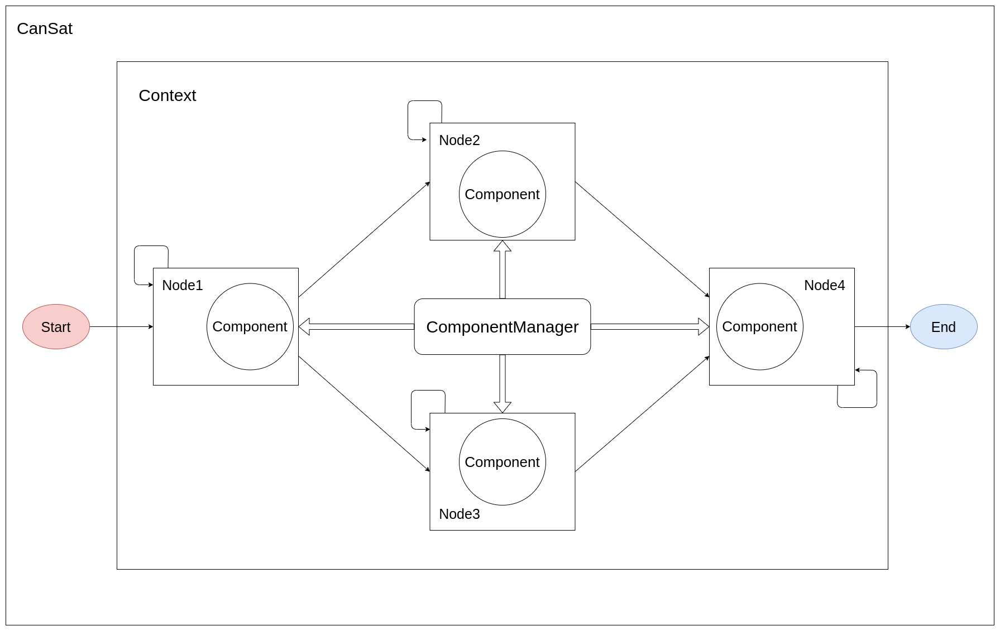

# pisat を用いたミッションの実装例

このドキュメントは

- [pisat のサブパッケージについて](pkg_overview.md)
- [pisat システムについて](system.md)
- [pisat を利用した実装について](implementation.md)
- [独自の拡張について](self_expansion.md)

を読んだことを前提としています．

## システムの全体像

これまでのドキュメントでは，

- どのようなサブパッケージがあるか
- ミッションの流れと状態 (Context と Node)
- Node の実装
- コンポーネントの実装

を中心に扱って来ました．
そして，pisat システムにおける主要なクラスとして

- Context
- Node
- Component

があるという説明をしました．
Node とはミッションにおける「状態」であり，
Context はそのような状態の全体像を管理するものでした．
また，Component とは Node 内で用いる部品のようなものであり，
Component を Node 内で使用するためには，Node のインスタンス変数として
渡される ComponentManager を介して呼び出すのでした．
ここまでの話を概念図として表すと下図のようになります．



ほとんどのミッションでは上述の3つのクラスは必要になると考えられますが，
そのうちユーザーが実装すべきものは Node と Component です．
ただし，コンポーネントについては pisat 内に含まれるコンポーネントを
利用するのであれば実装する必要はありません．
つまり，ユーザーが実装すべきものの大半は Node になるわけです．

Context は既に pisat 実装されているものを使います．
[第2回のドキュメント](system.md)で述べたように，Context 初期化時には
ミッションフローを渡す必要があります．
ミッションフローは上図の Node 間のグラフを反映させたものです．

Node の実装とは Node 内のコールバックメソッドを実装することを指します．
Node にはライフサイクルがあることは[第2回のドキュメント](system.md)で説明されています．
各コールバックには呼び出されるタイミングが決まっており，
ユーザーはそのタイミングを理解した上でコールバックを実装する必要があります．
また，コンポーネントが利用されるのも Node 内です．
コンポーネントを Node 内で使用するためには，ライフサイクル初期に呼び出される
Node.enter コールバック内で ComponentManager にコンポーネント名を渡して
コンポーネントを取得するのが一般的です．
ただし，ComponentManager は初めからどのようなコンポーネントがあるかということは
知らないので，ComponentManager の初期化時にコンポーネントを登録しておく必要があります．
コンポーネントの登録は ComponentManager.append メソッドで行うのでした．

ある Node 内で特に実装を気をつけるべきコールバックは Node.judge と Node.control です．
なぜなら，この2つのコールバックはそれぞれ別々のスレッドで非同期実行されるからです．
ユーザーはマルチスレッド特有の問題を極力少なくするために，[第3回のドキュメント](implement.md)で述べたように，

- RefQueue
- PostEvent

のようなロック機構付きのオブジェクトを使用する必要があります．

ここまでは，前回までのドキュメントのおさらいです．
さて，ここまでの内容でコンポーネントを利用しながら必要な Node を実装し，
実装した Node 間の関係 (ミッションフロー) を Context に登録することと
コンポーネントを適切に呼び出すために ComponentManager に使用するコンポーネントを
登録することが必要であることは理解できたでしょう．
ただし，ユーザーは最後にやることがあります．
それは CanSat クラスを初期化し，CanSat.run を呼び出しミッションを実行することです．
CanSat クラスの初期化時には，設定済みの Context と ComponentManager が必要です:

```python
from pisat.core.cansat import CanSat

# context: Context
# manager: ComponentManager
cansat = CanSat(context, manager)

# ミッションの開始
cansat.run()
```

CanSat.run メソッドが呼び出されると，Context に登録された開始 Node から順に Node のライフサイクルが
処理されていきます．
そして，終了 Node に達し，ミッション終了を表すフラグ値がその Node の judge コールバックによって
返されると，CanSat オブジェクトはミッションの終了を検知し，その Node 終了後に run メソッドは終了します．
つまり，run メソッドを呼び出すことで，実装した Node のコールバックが Context に登録したミッションフローに
従って順番に実行されていくというわけです．

### CanSat クラスの役目

CanSat クラスの役目はミッションの実行を管理することです．
ミッションの実行内容については CanSat クラスには定義されていません．
あくまで，決まった手順で処理することだけに徹するのが CanSat クラスです．
このような意味で CanSat クラスの変更は pisat システムの変更を意味します．

CanSat オブジェクトはミッション実行に必要な情報を全て外部から受け取る必要があります．
初期化時に Context オブジェクトや ComponentManager オブジェクトを受け取っているのはこのためです．
Context オブジェクト初期化時にはミッションフローとして実装済み Node を渡しますから，
CanSat オブジェクトには Context オブジェクトを介して実装済み Node の情報が渡されます．

CanSat オブジェクトは現在の Node から次の Node へと状態遷移をすることになって初めて
次の Node をインスタンス化します．
そのときまでは実装済み Node クラスはクラスのままでインスタンス化されません．
実装済み Node のインスタンス化の際には，CanSat オブジェクトはその Node に

- PostEvent オブジェクト
- ComponentManager オブジェクト

を渡します．
Node でこれらのインスタンス変数を使用することが出来るのはこのためです．

CanSat クラスは初期化時に Context と ComponentManager の他にも
DataLogger や SystemLogger を受け取ることが出来ます．
それらを受け取ることで CanSat オブジェクトはデータログとシステムログを記録できるようになります．
特に DataLogger が渡されると Node.judge コールバックの引数として，
データロガーが取得したデータログが CanSat オブジェクトによって渡されます．
これによって，ユーザーがいちいちデータを取得したり，それを保持したり，ファイルに記録したり
する手間が省け，judge コールバックにおいては状態遷移フラグの検知の実装のみに集中することが出来ます．


## データログとシステムログ

pisat には重要なログとして，データログとシステムログがあります．

データログとはセンサーやアダプターから取得されたデータの記録のことです．
データログはミッション実行において極めて重要な要素の1つです．
データログは状態遷移の判断材料になるだけではなく，
ロボットなどの場合には制御のために必要なパラメータの実データになりうるものです．

一方でシステムログとは，どのような Node を経由してミッションが実行されたかなどの
pisat システムに関する実行時の記録です．
例えば，システムログには何時何分何秒にどの Node でどのコールバックが呼び出されたか
などの記録が含まれます．

このようなデータログとシステムログを管理するクラスが DataLogger と SystemLogger です．
DataLogger はデータログを取得するのみならず，データのキャッシュしたり(つまりメモリ内に一定数を保持したり)，
ファイルに書き込みすることも行います．
ただし，このような副次的な操作は DataLogger クラスの実装時に抽象化されており，
ユーザーは明示的にそのような操作をする必要はありません．
DataLogger からデータを取得すれば，自動的にキャッシュやファイル書き込みも行われます．
SystemLogger についてもユーザーが明示的にシステムログを記録する処理をする必要はありません．
ただし，Node のコールバック実行中に特別にログを残したい場合などは，
明示的に SystemLogger を用いてシステムログを残すことは可能です．

DataLogger と SystemLogger は特に何もしなくても CanSat クラス内部で
いい感じに処理されるコンポーネントです．
ユーザーは DataLogger と SystemLogger を初期化し，それを CanSat クラス初期化時に渡す必要はあります．

DataLogger 初期化には SensorController と DictLogQueue のオブジェクトを渡す必要があります．
SensorController はセンサーとアダプターを統合し，センサーからのデータの取得と，
そのデータをアダプターに与え計算を行うという処理を1度に引き受けるクラスです．
したがって，SensorController の初期化時には SensorGroup と AdapterGroup を渡す必要があります．
SensorGroup はセンサーのグループを表すクラスで，センサーを登録することで登録されたセンサーの
集合体を構築します．
AdapterGroup も同様にアダプターの集合体を構築します．
SensorController は SensorGroup と AdapterGroup を受け取ることで，
センサーとアダプターの集合体を統合します．
また，DictLogQueue は LogQueue の具象クラスです．
LogQueue はデータログのコンテナを表します．
LogQueue は抽象クラスであり，完全に実装したクラスは ListLogQueue と DictLogQueue で，
それぞれデータログを List[Logable]，Dict[Logable] として受け付けます．
センサーの readf メソッドと read メソッドの戻り値の型と一緒であることがわかるかと思います．
LogQueue はデータログを最新のいくつかだけメモリ内に保持し，
一定の容量を超えると自動的に古いデータをファイルに書き込みます．
つまり，LogQueue の中には常に新しいデータのみが保持される状態になります．
上述した DataLogger の性質のほとんど全ては SensorController と LogQueue の性質を
利用することで実現されています．

SystemLogger の初期化には特別に必要なコンポーネントなどはありません．
ただしオプション引数はいくつか存在します．
詳しくは API を参照してください．


## ミッション構築例

ここまでの内容をコードで表現すると以下のようになります．
ここでは TestNode1，TestNode2 という Node が実装されていると仮定します．

```python
import pigpio

from pisat.handler import PigpioI2cHandler
from pisat.sensor import SensorGroup, Bme280, Apds9301
from pisat.adapter import AdapterGroup, BarometerAdapter
from pisat.core.logger import SensorController, DictLogQueue
from pisat.core.logger import DataLogger, SystemLogger
from pisat.core.manager import ComponentManager
from pisat.core.context import Context
from pisat.core.cansat import CanSat

from test_node1 import TestNode1
from test_node2 import TestNode2

def main():

    # 今回はミドルウェアとして pigpio を使用する
    pi = pigpio.pi()

    # センサーのためのハンドラの初期化
    handler_bme280 = PigpioI2CHandler(pi, 0x76, name="handler_bme280")
    handler_apds9301 = PigpioI2CHandler(pi, 0x53, name="handler_apds9301")

    # センサーの初期化
    bme280 = Bme280(handler=handler_bme280)
    apds9301 = Apds9301(handler=handler_apds9301)
    sgroup = SensorGroup(bme280, apds9301)

    # アダプターの初期化
    barometer_adapter = BarometerAdapter()
    agroup = AdapterGroup(barometer_adapter)

    # 高レベルコンポーネントの初期化
    sencon = SensorController(sgroup, agroup)
    logque = DictLogQueue(maxlen=1000)
    dlogger = DataLogger(sencon, logque)
    slogger = SystemLogger()

    # ComponentManager の初期化
    # dlogger 内のコンポーネントを再帰的に検索し登録する
    manager = ComponentManager(dlogger, slogger, recursive=True)

    # Context の初期化
    context = Context({
        TestNode1: {True: TestNode2, False: TestNode1},
        TestNode2: {True: None, False: TestNode2}
    })

    # CanSat の初期化
    cansat = CanSat(context, manager, dlogger, slogger)

    # ミッションの実行
    cansat.run()

if __name__ == "__main__":
    main()
```

上記のコードはミッションを実行するためのコードです．
主な流れは，必要な Node は全て実装済みとして，

1. 使用するコンポーネントを次々に初期化
2. ComponentManager にコンポーネントを登録
3. Context にミッションフローを登録
4. CanSat を初期化し実行

となります．


## まとめ

今回のドキュメントでは，

- システムの全体像
- CanSat クラス

に焦点を当て説明をしました．
そして最後に簡単なミッションフローを例として，実行ファイルの作成を行いました．
実行ファイルは，これまで作成してきた Node やコンポーネントを集結させ，
ミッション実行に必要な設定を行うファイルであることが理解できたでしょう．

今回のドキュメントで pisat のイントロは終了です．
あとは実践あるのみです．
より実装について学びたい場合は，いくつかの[サンプル](../../../../sample/)を参照してみると良いでしょう．
各クラスの詳細な内容は該当する API やコードを参照してください．
