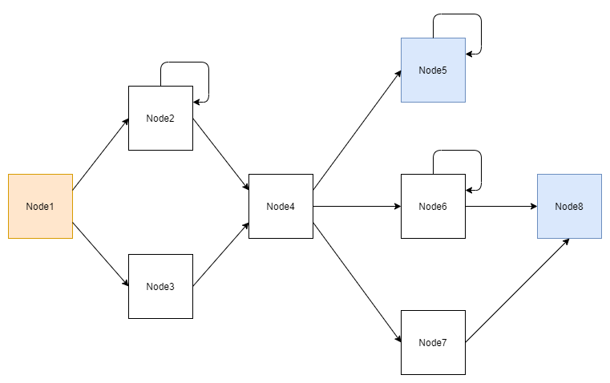
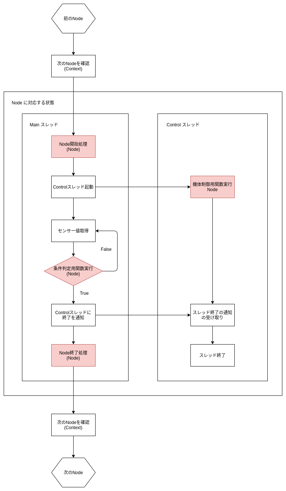
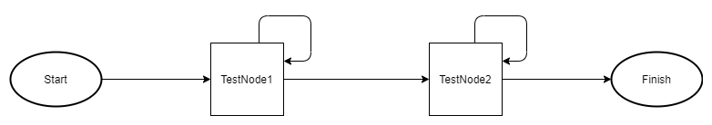

# pisat システムについて

このドキュメントは[前回のドキュメント](./pkg_overview.md)を読んだことを前提としています．


## 概要

pisat システムは pisat フレームワークのアーキテクチャです．
pisat フレームワークは pisat.core で実装されていますから，
pisat システムは pisat.core がどのように実装されるべきかを決定づける設計とも言えます．

ユーザーは pisat システムを用いてミッションを作成します．
一般的にミッションと言えば，何らかの目的を持ってその目的を遂行する任務のようなものを
想像するかと思います．
また，ミッションには**流れ**があることは容易に想像できることでしょう．
そして，ミッションに流れがあるのなら，その流れを何らかの基準を設けることで分割できるはずです．
分割した流れの断片は**状態**と呼んでも不自然ではないでしょう．
pisat システムはこの**流れ**と**状態**を定義することで動作するアプリケーションを目指します．

このようなミッションの流れを規定するクラスは **pisat.core.nav** で定義されています．


## pisat システムの規定する流れと状態

さきほどは pisat システムはミッションの**流れ**と**状態**が定義されることで動作すると述べました．
ここでは pisat.core ではその**流れ**と**状態**がどのように実装されているのかについて述べます．

pisat システムでは，自身の状態を管理し，状態を遷移することでミッションが進んでいきます．
状態の遷移がミッションの流れに相当します．
**pisat.core.nav** では状態を **Node**，状態の全体像を **Context** というクラスで表現しています．

Node は流れの断片としての状態を表すクラスであり，いくつかの抽象メソッド（空のメソッド）が用意されています．
その抽象メソッドは実行時に規定されているタイミングで呼び出されるコールバックメソッドです．
例えば，ある Node に遷移した際には，Node.enter というメソッドが自動的に呼び出されるように設計されています．
しかし，デフォルトではほとんどのコールバックメソッドは空なので，ユーザーはこのコールバックメソッドを
実装することで自分の好きな処理をさせることが出来ます．

Context は Node と Node 間の遷移を表す情報を持っています．
Context によって流れの断片が繋ぎ合わされ，pisat システムがミッションの一連の流れを認識できるようになります．


## Context の役割

Context の役割は，状態の流れを保持し，流れの中で

- 最初の Node
- 現在の Node
- 次の Node
- 最後の Node（複数可）

という情報を管理することにあります．
これらの情報から pisat システム（主に CanSat オブジェクト）は実行時に，
最初に自身をどの Node にいるか設定し，いま自身がどの Node にいて，次はどの Node に行くべきで，
ミッションがどのようにすれば終了するかを認識します．

それでは Node の流れ（ミッションフロー）を視覚的に表してみましょう．
Context が保持すはミッションフローは下図のように表現できます．
これは一種のグラフになっています．
ただし，いくつかの重要な性質があります．

1. 開始 Node （橙色）は１つのみ
2. 終了 Node （青色）は複数可
3. 中間 Node （白色）の遷移の入出力は自由
4. 自分自身への遷移も可能

Context はこれらの重要な性質をチェックし，問題がなければユーザーが設定した
ミッションフローを許容し，pisat システムの運用を補佐します．



Context にはミッションのフローチャートを直接反映することが出来ます．
分岐のない状態遷移を定義することも可能であり，終了 Node の存在しない
ミッションを作成することもできます（4の性質より）．

具体的に Context にミッションフローを設定する方法は[ミッションフローの設定](#ミッションフローの設定)
で説明します．


## Node のライフサイクル

Node はミッションの流れを分割した際の1つの状態に相当し，
Node 間の遷移の情報を管理するのは Context の役割であることを述べました．
ここでは全体の流れではなく，1つの Node に着目して話を進めましょう．

多くの状態には始まりと終わりがあります．
これは，現在の状態を抜け出し，次の状態へと遷移するプロセスが何かしら存在することを意味します．
身近な例でいうと，多くの子供には小学生という状態から中学生という状態へと遷移するプロセスがあり，
その状態遷移の引き金は時間です．
このアナロジーとして，Node 間の遷移にも何らかの引き金を用います．
引き金となりうる変数は**フラグ**と呼んでいます．
フラグの値があらかじめ用意しておいた値と一致したとき，pisat システムは
現在の Node から抜け出すべきであると判断します．
そして，抜け出す準備が出来次第，Context から次の Node の情報を受け取り状態を遷移します．

Node には一定の決まった処理手順があります．
Node に入ってから抜けるまでの処理手順のことを Node の**ライフサイクル**と呼びます．
次の図は，Node のライフサイクルを表します．



上図において赤塗りの処理は全て，Node クラスのコールバックメソッドであり，
かつユーザーによってオーバーライドされるべきメソッドを指しています．
つまり，ユーザーは Node クラスを基底クラスとした子クラスを実装する必要があります．
赤塗りのメソッドにはそれぞれに役割があります．
役割に合った処理を実装することでミッションを実行することが可能となります．
よく利用すると思われるメソッドには，

- Node.enter
- Node.judge
- Node.control
- Node.exit

があります．
これらのメソッドにはデフォルトでは実装はありません．
実装の例などは[次回のドキュメント](./implementation.md)で説明します．
それぞれのコールバックメソッドの簡単な説明は以下の通りです．

### Node.enter

Node に入ってきたときの開始処理を行います．
遷移後に一番最初に実行されるコールバックメソッドです．
引数，戻り値はありません．
その Node 内で用いるコンポーネントなどを呼び出すなどの初期化処理を行うことが目的です．
Node.\_\_init\_\_には実装があるので，オーバーライドしないでください。

このコールバックが実行されると，pisat システムは Node.control，Node.judge メソッド
の実行に移ります．

### Node.judge

現在の Node から状態遷移すべきかを判定するためのコールバックです．
このコールバックの引数には pisat システムからセンサーなどからのデータが与えられます．
その値をもとに状態遷移すべきかを判定し，戻り値としてフラグ値を返す必要があります．
pisat システムはフラグの値によって次の Node を特定します．
戻り値は必ず Context に設定した値のうちの1つでなくてはなりません．
このことについては，[ミッションフローの設定](#ミッションフローの設定)で改めて説明します．

このコールバックは pisat システムによって Main スレッドで反復的に呼び出されます．
このコールバックから状態遷移のフラグ値が返ると，Main スレッドは後述する 
Control スレッドが終了するまでブロックされます．

### Node.control

現在の Node でのバックグラウンド処理を行うためのサブルーチンです．
このメソッドは Node.enter コールバックが呼ばれた後に，
Main スレッドによって起動された Control スレッド上で実行されます．
引数，戻り値はありません．

ユーザーは実装する際，このサブルーチンが適切に終了するようにする必要があります．
pisat システムは Main スレッドで Node.judge コールバックを呼び出し，
状態遷移を表すフラグ値を取得すると直ちに PostEvent オブジェクトを介して 
Control スレッドに通知します．
無限ループなどの反復処理をこのサブルーチンで行う際には，
定期的に PostEvent オブジェクトのイベントの情報を取得し，
イベントがセットされたら Control スレッドを終了するように処理する必要があります．

### Node.exit

Node を抜け出す直前に呼び出されるコールバックです．
このコールバックが呼び出されるときには既に Control スレッドは消滅している状態です．
スレッドセーフな同期的な処理を行う際に利用できます．

### インスタンス変数

Node には Node 内で利用するためのいくつかのインスタンス変数が提供されます．
現時点では以下のオブジェクトが変数として提供されています．

- ComponentMangager
- PostEvent

ComponentManager は内部のコンポーネントの取得・検索機能を持つオブジェクトで，
このオブジェクトを介してユーザーは Node 内部でコンポーネントを取得し操作できます．

PostEvent は [threading.Event](https://docs.python.org/ja/3/library/threading.html) 
クラスを継承したサブクラスで，基本的には Event オブジェクトのように振舞います．
ただし，イベントをセットする際にオブジェクトを渡すことができるように拡張されており，
この機構は Control スレッドでフラグ値を確認するためのものです．
つまり，pisat システムは Node.judge コールバックを呼び出し，
状態遷移を表すフラグ値を取得すると，そのフラグ値を PostEvent に渡しイベントをセットします．


## ミッションフローの設定

さて，ここまで Context や Node の概要を説明してきました．
ここからは具体的にどのようにそれらを実装していくかに話を移していきます．

まずは Context にミッションフローをセットする方法です．
ミッションフローは，[Context の役割](#context-の役割)で説明した**4つの性質**に注意して
設定する必要があります．
設定する情報は

1. Node クラス
2. 状態遷移のためのフラグ値
3. 状態遷移先の Node クラス
4. 開始 Node

の4点です．例えば次にように，Context クラスのコンストラクタを用いて渡します: 

```python
context = Context({
                    TestNode1: {True: TestNode2, False: TestNode1},
                    TestNode2: {True: None, False: TestNode2}
                  }, 
                  start=TestNode1)

```

まず第1引数に着目しましょう．
Context はミッションフローを辞書型のオブジェクトで管理します．
ただし，辞書の中に辞書があるので注意が必要です．
外側の辞書の構造は以下のとおりです：

```python
{(Node クラス): (目的地 destination)}
```

そして，目的地もまた辞書で表現されており，

```python
{(フラグ値): (遷移先 Node クラス)}
```

という構造を持っています．
フラグ値はどんなオブジェクトでも構いませんが，
Node.judge の戻り値と一致するものでなければなりません．
また，Node オブジェクトではなく Node クラスを渡している
点にも注意が必要です．
上述の辞書型の構造からわかるように，
この第1引数の辞書型のオブジェクトで上述した4つの設定情報のうち，
3つの情報を渡すことが出来ています．

残る情報は開始 Node の情報です．
第2引数の start 引数にはこの開始 Node を渡します．
ミッション中の開始 Node はただ1つでなければなりません．
上記の例では TestNode1 が選択されているため，pisat システムはまず最初に
TestNode1 を起動しライフサイクルを実行することになります．

注意すべき点は終了 Node です．
終了 Node の定義はミッションが終了しうる Node です．
ミッションの終了は第1引数の辞書の遷移先 Node クラスの位置に None を選択することで
表現します．
つまり，上の例では TestNode2 は終了 Node ということになります．
終了 Node であっても，遷移先が None でないフラグ値が返れば，
終了を回避することは可能である点に注意してください．

また，Context には行き先が自分自身であっても明示的に指定しなければならない点にも
注意が必要です．
上の例では TestNode1 は judge コールバックが False を出力すると TestNode1，つまり
自分自身が行き先になるように設定されています．
pisat システムでは現在の Node から自分自身に遷移するような条件判定結果が得られた場合には，
Node の初期化は行わず，そのまま条件判定のループを続行します．
つまり，遷移先が現在の Node に一致する場合にはイベントのセットなどの処理は行われず，
judge コールバックが現在の Node とは異なるフラグ値を返したときのみ，
イベントのセットや現在の Node の終了処理に移ることが出来ます．

最後にここでの例を視覚的に表してみましょう：



今回の例は単純なものでしたが，より複雑なグラフも同様の手順で作成することが出来ます．


## まとめ

このドキュメントでは，

- Context
- Node

という2つの重要なクラスについて説明しました．
この2つのクラスは pisat システムにおいて中核を担うクラスで，
「ミッションとは何か」という問いから生まれたクラスです．

[次回のドキュメント](./implementation.md)では pisat を用いた実装について説明します．
特に，今回のドキュメントで述べた Node クラスのコールバックの実装や
前回のドキュメントで説明した様々なコンポーネントの Node 内での使用方法について述べます．
